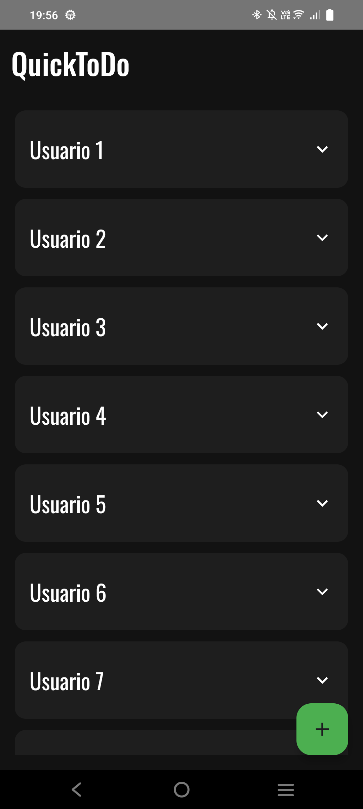
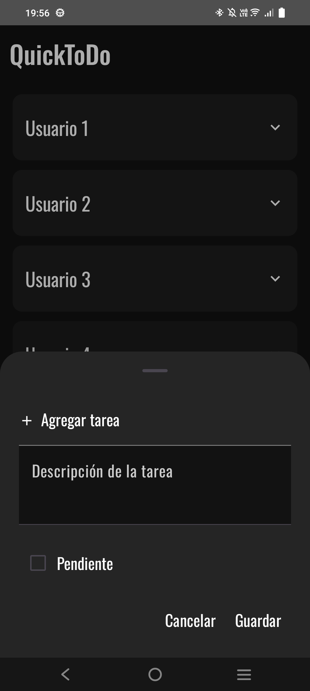
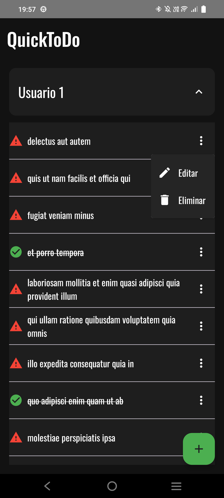
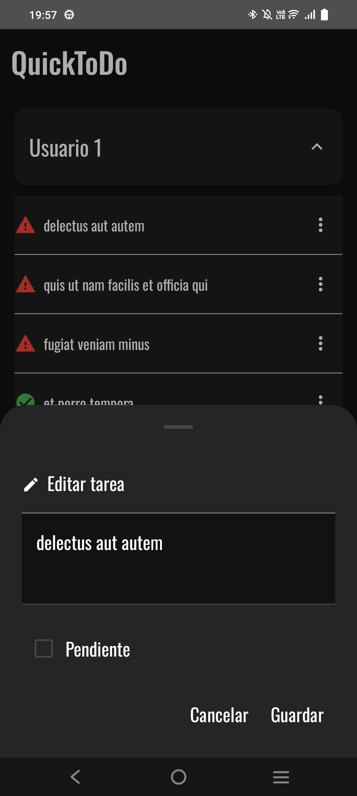
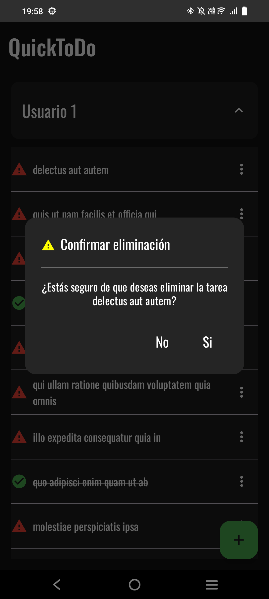

# QuickToDo - Aplicación de Gestión de Tareas

**QuickToDo** es una aplicación móvil que permite a los usuarios gestionar sus tareas de manera sencilla. Los usuarios pueden agregar, modificar y eliminar tareas. Esta aplicación está construida con **Kotlin** y **Jetpack Compose**, utilizando **Hilt** para la inyección de dependencias y **Retrofit** para la comunicación con el servidor. Las pruebas unitarias se realizaron con **MockK** para asegurar la estabilidad y fiabilidad del código.

---

## 📸 Demo

## 📝 Imágenes

### 1. Lista de tareas por usuario

### 2. Modal para agregar tarea

### 3. Tareas de un usuario

### 4. Modal de edición de una tarea

### 5. Diálogo para eliminar una tarea

## 🚀 Características

- **Agregar Tarea**: Permite al usuario añadir nuevas tareas.
- **Modificar Tarea**: Los usuarios pueden editar las tareas existentes.
- **Eliminar Tarea**: Los usuarios pueden eliminar tareas de la lista.
- **Interfaz Limpia y Moderna**: Utilizando Jetpack Compose para una experiencia de usuario fluida y moderna.
- **Pruebas Unitarias**: Se han implementado pruebas unitarias usando MockK para asegurar el funcionamiento correcto de las funciones de la app.

## 🛠️ Tecnologías utilizadas

- **Kotlin**: El lenguaje principal de la aplicación.
- **Jetpack Compose**: Para la construcción de la interfaz de usuario de manera declarativa.
- **Hilt**: Inyección de dependencias para una arquitectura más limpia y modular.
- **Retrofit**: Para realizar peticiones a APIs RESTful.
- **MockK**: Para pruebas unitarias.

## 🏗️ Arquitectura MVVM

Se ha utilizado la arquitectura **MVVM (Model-View-ViewModel)** debido a sus múltiples ventajas:

- **Separación de responsabilidades**: La UI no maneja directamente la lógica de negocio, lo que facilita el mantenimiento y la escalabilidad.
- **Facilidad para realizar pruebas unitarias**: Al mantener la lógica de negocio en ViewModels, es más sencillo testear sin depender de la UI.
- **Reutilización de código**: ViewModels pueden ser utilizados en diferentes composables sin generar dependencias innecesarias.

## 🔧 Funcionalidades

1. **Lista de tareas**: Muestra las tareas existentes para cada usuario.
2. **Agregar una tarea**: Modal donde se puede ingresar el título y la descripción de la nueva tarea.
3. **Editar tarea**: Modal de edición para modificar el título y el estado de una tarea.
4. **Eliminar tarea**: Diálogo de confirmación para eliminar una tarea.

---
